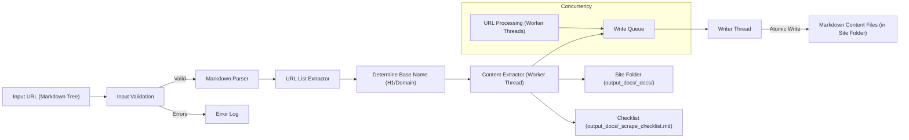

# Codebase Summary

## Key Components

1. **Input Processor (Function 2)**

   - Accepts a URL pointing to a raw text file (e.g., markdown) containing a tree structure of URLs.
   - Validates the input URL.
   - Parses the file content line by line, expecting the format `[TREE_PREFIX][SPACE][URL]` (as defined in `project_brief.md`) to extract the list of URLs to be crawled.

2. **Content Extractor (Function 2)**

   - Determines a base name, preferably from the H1 of the first URL, falling back to the domain name (e.g., `<h1>` or `<website_name>`).
   - Creates a root output folder `output_docs/` if it doesn't exist.
   - Creates site-specific subfolders within `output_docs/` (e.g., `output_docs/<base_name>_docs/`).
   - Generates markdown files preserving structure for each crawled URL within the site-specific folder.
   - Maintains site-specific checklist trackers within `output_docs/` (e.g., `output_docs/<base_name>_scrape_checklist.md`).

3. **Image Processing**

   - Identifies image URLs and alt text from HTML (`` tags).
   - Preserves image references as standard Markdown links (``).
   - Does not download image files.

4. **Concurrency System**
   - **Write Queue:** A dedicated thread (`writer_thread`) handles all file writing operations via a queue (`write_queue`) to ensure atomicity and prevent race conditions during file saving.
   - **File Locking:** Uses `threading.Lock` for atomic updates to shared resources:
     - Checklist files (`<base_name>_scrape_checklist.md`)
     - Log files (`<website name>_errors.log`)
   - **Thread-per-URL Processing:** Each URL is processed in a separate worker thread (`worker`) which:
     - Fetches and parses HTML.
     - Generates Markdown content.
     - Puts the result `(filepath, content)` onto the `write_queue`.
     - Handles errors independently.
     - Cleans up resources automatically.
     - Maintains no shared state with other worker threads regarding content processing.

## Data Flow

## External Dependencies

- **Core Libraries**

  - BeautifulSoup4: HTML parsing
  - Requests: HTTP requests
  - html2text: HTML to Markdown conversion (including tables)
  - lxml: Faster parsing backend for BeautifulSoup
  - urllib3: Dependency for Requests (retry logic)
  - python-json-logger: Structured logging
  - tqdm: Progress bar
  - Standard Python libraries (`re`, `os`, `urllib.parse`, `threading`, `queue`, `datetime`, `argparse`, `sys`, `logging`)
  - `dev_docs/error_codes.md`: Defines the structured error codes used in logging.

- **Infrastructure**
- Python 3.10+: Runtime environment

## Recent Changes

- Implemented new file structure per project_brief.md
- Added proper error handling for all components
- Documented automation workflow
- Created standardized documentation templates
- Added concurrency system with:
  - Write queue
  - File locking (for checklist/log files)
  - Thread-per-URL processing (adjusted from thread-per-row)
  - Implemented dedicated writer thread and queue for atomic file writes.
