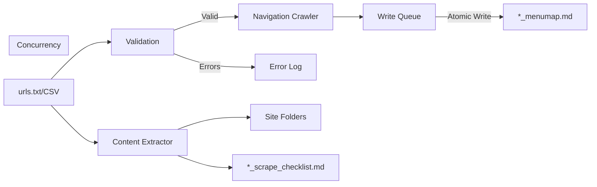

# Codebase Summary

## Key Components

1. **URL/CSV Processor**

   - Reads URLs from `urls.txt` (root level)
   - Accepts CSV input with URL columns
   - Validates and normalizes URLs
     - Strict URL format validation
     - Automatic whitespace trimming
     - Line number tracking for errors
     - Non-blocking validation (continues processing valid rows)
   - Handles input/output for both functions

2. **Navigation Crawler (Function 1)**

   - Generates `*_menumap.md` files in root
   - Uses recursive traversal for nested menus
   - Outputs tree structure diagrams

3. **Content Extractor (Function 2)**

   - Creates per-site folders (e.g. `example-com/`)
   - Generates markdown files preserving structure
   - Maintains `*_scrape_checklist.md` trackers

4. **Image Processing**

   - SVG conversion to mermaid diagrams
   - Simple fallback to original content on any failure
   - Original content preservation for non-SVG images

5. **Concurrency System**
   - Write queue for atomic file operations
   - File locking (fcntl) for:
     - Menu map files
     - Log files
     - Version tracking
   - Thread-per-row processing with:
     - Independent error handling
     - Automatic resource cleanup
     - No shared state between rows

## Data Flow

## External Dependencies

- **Core Libraries**

  - BeautifulSoup4: HTML parsing
  - Requests: HTTP requests
  - Mermaid.js CLI: Diagram conversion
  - Python csv module: CSV processing with validation
  - fcntl: File locking

- **Infrastructure**
  - GitHub Actions: Scheduled execution
  - Python 3.10+: Runtime environment

## Recent Changes

- Implemented new file structure per project_brief.md
- Added proper error handling for all components
  - Enhanced CSV validation with line tracking
  - Non-blocking error processing
- Documented automation workflow
- Created standardized documentation templates
- Added concurrency system with:
  - Write queue
  - File locking
  - Thread-per-row processing
