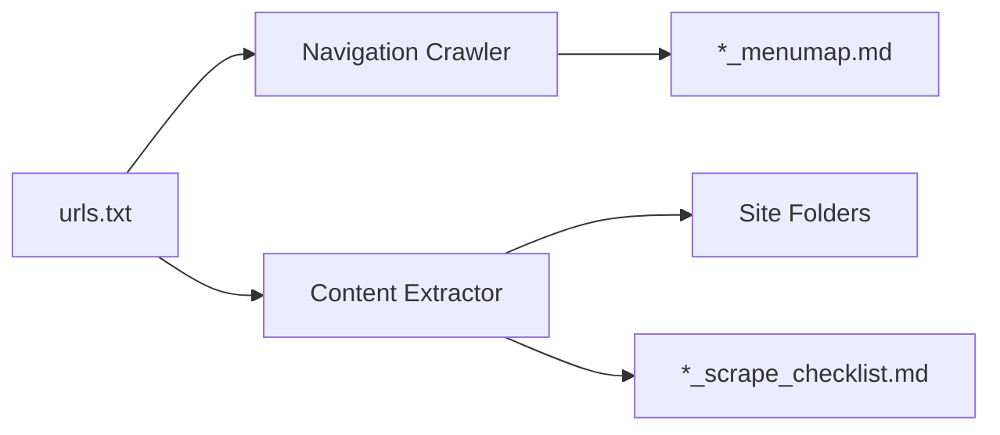

# Codebase Summary

## Key Components

1. **URL/CSV Processor**

   - Reads URLs from `urls.txt` (root level)
   - Accepts CSV input with URL columns
   - Validates and normalizes URLs
   - Handles input/output for both functions

2. **Navigation Crawler (Function 1)**

   - Generates `*_menumap.md` files in root
   - Uses recursive traversal for nested menus
   - Outputs tree structure diagrams

3. **Content Extractor (Function 2)**

   - Creates per-site folders (e.g. `example-com/`)
   - Generates markdown files preserving structure
   - Maintains `*_scrape_checklist.md` trackers

4. **Automation**
   - GitHub Actions workflow at `.github/workflows/daily-scrape.yml`
   - Scheduled daily execution

## Data Flow

## External Dependencies

- **Core Libraries**

  - BeautifulSoup4: HTML parsing
  - Requests: HTTP requests
  - Mermaid.js CLI: Diagram conversion

- **Infrastructure**
  - GitHub Actions: Scheduled execution
  - Python 3.10+: Runtime environment

## Recent Changes

- Implemented new file structure per project_brief.md
- Added proper error handling for all components
- Documented automation workflow
- Created standardized documentation templates
