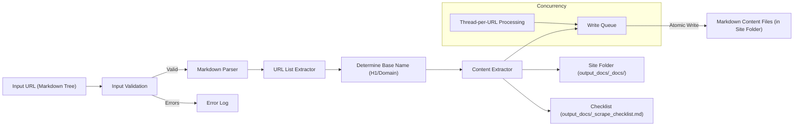

# Codebase Summary

## Key Components

1. **Input Processor (Function 2)**

   - Accepts a URL pointing to a raw text file (e.g., markdown) containing a tree structure of URLs.
   - Validates the input URL.
   - Parses the file content line by line, expecting the format `[TREE_PREFIX][SPACE][URL]` (as defined in `project_brief.md`) to extract the list of URLs to be crawled.

2. **Content Extractor (Function 2)**

   - Determines a base name, preferably from the H1 of the first URL, falling back to the domain name (e.g., `<h1>` or `<website_name>`).
   - Creates a root output folder `output_docs/` if it doesn't exist.
   - Creates site-specific subfolders within `output_docs/` (e.g., `output_docs/<base_name>_docs/`).
   - Generates markdown files preserving structure for each crawled URL within the site-specific folder.
   - Maintains site-specific checklist trackers within `output_docs/` (e.g., `output_docs/<base_name>_scrape_checklist.md`).

3. **Image Processing**

   - SVG conversion to mermaid diagrams
   - Simple fallback to original content on any failure
   - Original content preservation for non-SVG images

4. **Concurrency System**
   - Write queue for atomic file operations
     - File locking (fcntl) for:
       - Checklist files (`<website name>_scrape_checklist.md`)
       - Log files (`<website name>_errors.log`)
   - Thread-per-URL processing with:
     - Independent error handling
     - Automatic resource cleanup
     - No shared state between threads/URLs

## Data Flow

## External Dependencies

- **Core Libraries**

  - BeautifulSoup4: HTML parsing
  - Requests: HTTP requests
  - Mermaid.js CLI: Diagram conversion
  - Python Markdown Parser (e.g., `markdown` library or similar): To parse the input tree structure file.
  - fcntl: File locking (if applicable on the target OS, for checklist/log files)
  - `dev_docs/error_codes.md`: Defines the structured error codes used in logging.

- **Infrastructure**
- Python 3.10+: Runtime environment

## Recent Changes

- Implemented new file structure per project_brief.md
- Added proper error handling for all components
- Documented automation workflow
- Created standardized documentation templates
- Added concurrency system with:
  - Write queue
  - File locking (for checklist/log files)
  - Thread-per-URL processing (adjusted from thread-per-row)
